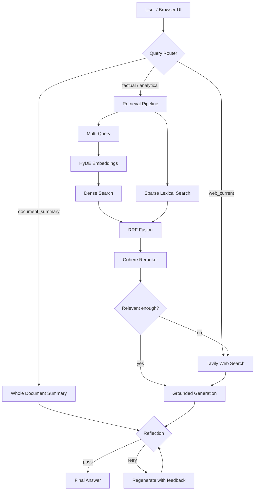

# Agentic RAG System

A full-stack **Agentic Retrieval-Augmented Generation (RAG)** application for querying and summarizing user-uploaded PDFs.

Unlike a basic RAG pipeline that always retrieves chunks and immediately asks an LLM to answer, this project makes runtime decisions about **where to retrieve from, whether the retrieved context is good enough, whether web correction is needed, and whether the generated answer should be accepted or regenerated**.

The project includes a browser UI, PDF ingestion pipeline, hybrid retrieval, LangGraph orchestration, CRAG-style correction, Self-RAG-style reflection, whole-document summarization, workspace isolation, and local/cloud Qdrant support.

---

## Features

- **Browser-based PDF upload and chat UI** — no Postman required for normal use.
- **Parent-child chunking** — retrieve precise child chunks while giving the LLM larger parent context.
- **Local embeddings** with `all-MiniLM-L6-v2` through `@xenova/transformers`.
- **Dense + sparse hybrid retrieval** in Qdrant.
- **Multi-query retrieval** — generates multiple phrasings of the user's question to improve recall.
- **HyDE (Hypothetical Document Embeddings)** — embeds hypothetical answers instead of only raw questions.
- **Reciprocal Rank Fusion (RRF)** — combines dense and sparse result rankings without directly mixing incompatible score scales.
- **Cohere reranking** — cross-encoder reranking before context reaches the LLM.
- **LangGraph agentic workflow** with conditional routing.
- **CRAG-style retrieval grading** — weak document retrieval can trigger Tavily web search.
- **Direct live-web routing** for explicitly current/latest queries.
- **Self-RAG-style reflection** — checks answer faithfulness and completeness and can regenerate once with feedback.
- **Whole-document PDF summaries** — scans the selected document instead of incorrectly summarizing only semantic top-K chunks.
- **Workspace isolation** — browser workspaces are filtered in Qdrant so uploaded document contexts do not get mixed across users/sessions.
- **LangSmith-compatible tracing** through LangChain's Groq integration.
- **Cloud-ready Qdrant configuration** through environment variables.

---

## System Architecture



The regeneration loop is intentionally bounded. The graph allows at most **two generation attempts** so reflection cannot create an uncontrolled loop.

---

## Query Routing

The router currently recognizes four query modes:

| Query type | Example | Path |
|---|---|---|
| `factual` | `How does array rotation work?` | Document retrieval → grading → generation |
| `analytical` | `Compare the two approaches described in the PDF` | Wider document retrieval → grading → generation |
| `document_summary` | `Summarise this PDF` | Full selected-document scan → map-reduce summary |
| `web_current` | `What is the latest Node.js release?` | Tavily → generation |

For normal factual/analytical questions, document retrieval is tried first. If the grading node decides the indexed documents do not answer the question, the graph can correct the retrieval path with Tavily web search.

---

## Retrieval Pipeline

### 1. Parent-Child Chunking

The system stores small child chunks for retrieval precision while keeping larger parent text in metadata. Qdrant matches on the child chunk, but the generation layer receives the parent context.

This reduces the usual trade-off between:

- **small chunks** → better matching but weak context
- **large chunks** → richer context but less precise matching

### 2. Multi-Query Retrieval

The original question is expanded into multiple alternate phrasings. Retrieval runs across the original query plus generated variations, improving recall when a document uses different wording from the user.

### 3. HyDE

For dense retrieval, the LLM generates a short hypothetical answer and the system embeds that answer. The idea is that an answer-like embedding can be closer to answer-containing document chunks than a short question embedding.

### 4. Dense Search

Embeddings are generated locally using:

```text
Xenova/all-MiniLM-L6-v2
Vector size: 384
Distance: Cosine
```

### 5. Sparse Lexical Search

The current sparse implementation uses **TF-normalized lexical weights with deterministic FNV-1a token hashing**.

> Important: this is **not canonical BM25**. It does not currently compute corpus-level IDF or the standard BM25 document-length normalization formula. The historical filename `bm25.js` is retained for project continuity, but the implementation is described accurately in code comments and here.

### 6. Reciprocal Rank Fusion

Dense similarity scores and sparse lexical scores are not directly comparable. Instead of applying an arbitrary weighted sum, RRF combines result lists using their **rank positions**.

### 7. Cohere Reranking

The fused candidate set is reranked with Cohere's cross-encoder. The reranker jointly evaluates query + candidate text and returns the strongest contexts before generation.

---

## Agentic Layer

### Query Router

The first LangGraph node classifies the request as `factual`, `analytical`, `document_summary`, or `web_current`.

The router does **not** reject a question simply because it may be outside the uploaded documents. For non-current questions, the system can still attempt retrieval and let the grading node decide whether corrective web search is needed.

### CRAG-Style Correction

After retrieval, a grading node asks whether the retrieved document context materially answers the user's question.

```text
Relevant context     → generate from documents
Weak/irrelevant      → Tavily web correction → generate
```

This reduces the risk of confidently answering from unrelated retrieved chunks.

### Grounded Generation

The generation node is instructed to use only the supplied document/web context. If information is missing or sources conflict, the answer should expose that limitation rather than invent facts.

### Self-RAG-Style Reflection

After generation, another node checks:

- **Faithfulness** — are factual claims supported by the supplied context?
- **Completeness** — did the answer address the actual question with the important available information?

If the result is materially weak, feedback is sent back to the generation step for one retry.

This is an LLM-as-judge quality gate, not a mathematical guarantee of correctness.

---

## Whole-Document Summarization

A whole-document summary should not use semantic top-K retrieval because that would summarize only the fragments most similar to the word `summary`.

For `document_summary` requests, the system instead:

1. identifies the active PDF in the browser workspace,
2. scans all Qdrant points belonging to that document,
3. deduplicates repeated parent contexts,
4. groups the document into manageable sections,
5. summarizes each section,
6. reduces those section summaries into one final summary,
7. sends the result through reflection.

This gives broad document coverage while staying within LLM context limits.

---

## Web UI

The frontend is served directly by the Express server from `public/`, so the project does not require a separate frontend deployment or CORS configuration.

From the UI a user can:

- drag/drop or browse for a PDF,
- upload and index it,
- keep multiple PDFs in a browser workspace,
- choose an active document,
- ask questions,
- request a whole-PDF summary,
- inspect agent routing metadata,
- inspect document/web sources returned by the backend.

The browser persists a workspace ID in `localStorage`. Uploaded Qdrant payloads include that workspace ID, and retrieval applies a matching filter.

---

## Tech Stack

| Layer | Technology |
|---|---|
| Runtime | Node.js |
| API / Web Server | Express.js |
| Agentic Orchestration | LangGraph.js |
| LLM Provider | Groq via `@langchain/groq` |
| Default LLM | `openai/gpt-oss-20b` (configurable) |
| Embeddings | `@xenova/transformers` — all-MiniLM-L6-v2 |
| Vector Database | Qdrant |
| PDF Parsing | `pdf2json` |
| Text Splitting | `@langchain/textsplitters` |
| Reranking | Cohere Rerank |
| Web Search | Tavily |
| Observability | LangSmith-compatible tracing |
| Frontend | Vanilla HTML, CSS and JavaScript |

---

## Project Structure

```text
Agentic-RAG-System/
├── public/
│   ├── index.html              # Browser UI
│   ├── app.js                  # Upload, workspace and query client logic
│   └── styles.css              # UI styling
│
├── src/
│   ├── graph/
│   │   ├── nodes/
│   │   │   ├── router.js       # Query classification
│   │   │   ├── retrieve.js     # Calls the advanced retrieval pipeline
│   │   │   ├── grade.js        # CRAG-style relevance grading
│   │   │   ├── webSearch.js    # Tavily correction / live search
│   │   │   ├── generate.js     # Grounded answer generation
│   │   │   ├── summarize.js    # Whole-document map-reduce summary
│   │   │   └── reflect.js      # Faithfulness/completeness reflection
│   │   ├── graph.js            # LangGraph nodes + conditional edges
│   │   ├── state.js            # Shared graph state
│   │   ├── smoke.js            # End-to-end graph smoke test
│   │   └── reflectionSmoke.js  # Deterministic regeneration test
│   │
│   ├── ingestion/
│   │   ├── pdfParser.js
│   │   ├── chunker.js
│   │   └── ingestPdf.js        # Shared ingestion service
│   │
│   ├── routes/
│   │   ├── upload.js           # Browser PDF upload
│   │   ├── ingest.js           # File-path ingestion API
│   │   ├── query.js            # Agentic query API
│   │   ├── debug.js
│   │   └── benchmark.js
│   │
│   ├── embedder.js
│   ├── vectorStore.js
│   ├── retrieval.js
│   ├── multiQuery.js
│   ├── hyde.js
│   ├── bm25.js
│   ├── rrf.js
│   ├── reranker.js
│   └── llm.js
│
├── index.js
├── package.json
├── .env.example
└── Readme.md
```

---

## Local Setup

### Requirements

- **Node.js 20+**
- **Docker** (for local Qdrant) or a Qdrant Cloud cluster
- Groq API key
- Cohere API key
- Tavily API key for live-web/corrective search
- LangSmith API key only if tracing is enabled

### 1. Clone the repository

```bash
git clone https://github.com/SHUBHANSHU602/Agentic-RAG-System.git
cd Agentic-RAG-System
```

For the Phase 3 PR branch before merge:

```bash
git checkout feat/phase-3-agentic-rag
```

### 2. Install dependencies

```bash
npm install
```

### 3. Configure environment variables

Create `.env` from `.env.example`.

```env
PORT=5000

GROQ_API_KEY=
GROQ_MODEL=openai/gpt-oss-20b

COHERE_API_KEY=
TAVILY_API_KEY=

QDRANT_URL=http://localhost:6333
QDRANT_API_KEY=
QDRANT_COLLECTION=docs

LANGSMITH_API_KEY=
LANGSMITH_PROJECT=agentic-rag
LANGSMITH_TRACING=true
```

`GROQ_AI_KEY` is still accepted as a legacy fallback, but `GROQ_API_KEY` is preferred.

### 4. Start Qdrant locally

```bash
docker run --rm -p 6333:6333 qdrant/qdrant
```

### 5. Start the app

```bash
npm run dev
```

Open:

```text
http://localhost:5000
```

The application creates the configured Qdrant collection automatically if it does not already exist.

---

## API

### `GET /health`

Simple service health check.

```json
{
  "status": "ok",
  "message": "agentic-rag running"
}
```

### `POST /upload`

Used by the browser UI. Accepts a raw PDF body (maximum 20 MB).

Headers:

```text
Content-Type: application/pdf
X-Workspace-Id: <workspace-id>
X-File-Name: notes.pdf
```

The temporary uploaded file is removed after ingestion; the indexed vectors remain in Qdrant.

### `POST /ingest`

Developer/API route for ingesting a PDF that already exists on the server filesystem.

```json
{
  "filePath": "C:/path/to/notes.pdf"
}
```

### `POST /query`

Runs the agentic graph.

Document question:

```json
{
  "question": "How does array rotation work?",
  "workspaceId": "<workspace-id>"
}
```

Whole-document summary:

```json
{
  "question": "Summarise this PDF",
  "workspaceId": "<workspace-id>",
  "documentId": "<document-id>",
  "documentSource": "notes.pdf"
}
```

Response includes the final answer plus route/debug metadata:

```json
{
  "answer": "...",
  "route": {
    "queryType": "factual",
    "retrievalDecision": "relevant",
    "webSearched": false,
    "generations": 1,
    "reflection": "pass"
  },
  "retrieved": 2,
  "sources": []
}
```

---

## Testing

### Standard graph smoke test

```bash
npm run graph:smoke -- "How does array rotation work?"
```

A successful in-document request should look conceptually like:

```text
router → retrieve → grade(relevant) → generate → reflect(pass)
```

### CRAG fallback test

Ask something absent from the indexed PDF:

```bash
npm run graph:smoke -- "Explain the CAP theorem in distributed systems"
```

Expected path:

```text
retrieve → grade(not_relevant) → Tavily → generate → reflect
```

### Current-information routing

```bash
npm run graph:smoke -- "What is the latest Node.js release?"
```

Expected path:

```text
router(web_current) → Tavily → generate → reflect
```

### Deterministic reflection/regeneration test

```bash
node src/graph/reflectionSmoke.js
```

The test deliberately injects an incorrect first answer. The real reflection node should reject it, pass feedback to generation, and accept the corrected second answer.

Expected core output:

```text
reflection after generation 1: retry
reflection after generation 2: pass
generations: 2
```

---

## Deployment

A simple deployment architecture is:

```text
Browser
   ↓
Railway / Node.js service
   ├── Express API
   ├── static frontend
   └── LangGraph workflow
           ↓
       Qdrant Cloud

External services:
Groq · Cohere · Tavily · LangSmith (optional)
```

For cloud deployment, configure:

```env
GROQ_API_KEY=
GROQ_MODEL=openai/gpt-oss-20b
COHERE_API_KEY=
TAVILY_API_KEY=

QDRANT_URL=https://<cluster>.cloud.qdrant.io
QDRANT_API_KEY=
QDRANT_COLLECTION=docs

LANGSMITH_API_KEY=
LANGSMITH_PROJECT=agentic-rag
LANGSMITH_TRACING=true
```

Do **not** hard-code secrets into the repository. Add them through the deployment platform's environment-variable/secret settings.

`PORT` should normally be left to the hosting platform in production; `index.js` already reads `process.env.PORT`.

---

## Workspace Isolation

The browser creates a persistent workspace ID and sends it with uploads and queries.

Each uploaded Qdrant point stores:

```text
workspaceId
documentId
source
```

Retrieval filters by `workspaceId`, while whole-document summarization additionally targets the active `documentId` (with `source` as a backward-compatible fallback for older indexed documents).

This prevents normal browser sessions from accidentally retrieving chunks uploaded in another workspace.

This is application-level isolation for the demo/project. It is **not a replacement for authentication/authorization** in a production multi-tenant SaaS system.

---

## Failure Handling

The workflow is designed to fail conservatively where possible:

- missing/failed Tavily search → explicit limitation instead of fabricating live information,
- malformed grading output → safer corrective path,
- malformed reflection output → stop instead of looping indefinitely,
- generation retry loop → capped at two attempts,
- missing document for summary → explicit re-upload/select-document message,
- upstream AI rate limit → API returns a rate-limit response instead of silently swallowing the failure.

---

## Design Decisions and Trade-offs

### RRF instead of raw score blending

Cosine similarity and sparse lexical relevance are produced on different scales. RRF avoids pretending those values are directly comparable and combines rankings by position instead.

### Local MiniLM embeddings

Embeddings run locally, so ingestion/query embedding does not require a paid embedding API. The trade-off is that a compact distilled model may have weaker semantic representation than larger hosted embedding models.

### Grading before generation

Weak retrieval should not automatically become LLM context. The relevance grader provides a decision point before generation and enables corrective web search.

### Bounded reflection

Reflection can improve weak answers, but unconstrained agent loops can increase latency/cost or fail to converge. This graph intentionally limits regeneration.

### Full-document scan for summaries

Semantic retrieval is appropriate for questions, not for whole-document coverage. Document summaries use a separate Qdrant scan + map-reduce path.

---

## Known Limitations

- Sparse retrieval is not full BM25 yet.
- LLM grading/reflection can still make incorrect judgments; it is a quality heuristic, not a formal verifier.
- Uploaded documents are isolated by workspace ID but there is currently no user authentication system.
- The current UI keeps workspace metadata in browser `localStorage`.
- Very large PDFs can increase ingestion and map-reduce summarization latency.
- External Groq, Cohere and Tavily availability/rate limits affect the corresponding pipeline stages.

---

## Verified Flows

The Phase 3 implementation has been manually tested locally for:

- in-document retrieval → generation → reflection,
- irrelevant document retrieval → CRAG web fallback,
- current-information direct web routing,
- Express `/query` end-to-end requests,
- reflection retry → corrected regeneration,
- graceful behavior when Tavily is unavailable,
- browser PDF upload/indexing,
- whole-document summary routing.

---

## Why This Project Is Agentic

The important distinction is **runtime control flow**.

A normal RAG pipeline is approximately:

```text
query → retrieve → generate
```

This project can instead do:

```text
query
  → classify intent
  → choose document retrieval / document summary / live web
  → grade retrieval quality
  → correct weak retrieval
  → generate
  → reflect on the answer
  → optionally regenerate
  → return
```

The LLM is therefore not used only as a text generator; it participates in routing, retrieval correction and answer-quality decisions inside a bounded graph.

---

## Author

Built by **Shubhanshu Singh** as a hands-on exploration of advanced RAG retrieval, agentic orchestration, corrective retrieval, grounded generation and self-reflection.
